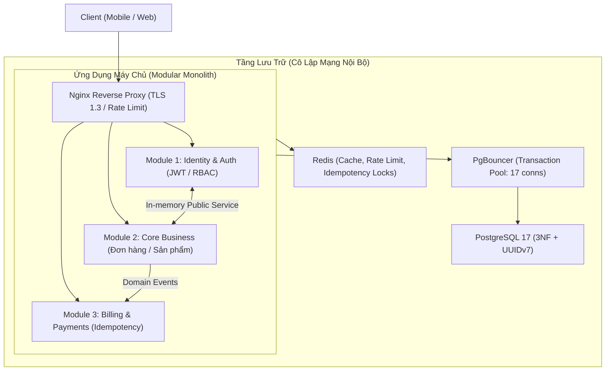

# 🏛️ Bản Vẽ Kiến Trúc Hệ Thống (Architecture Blueprint): [Tên Dự Án]

> *Tài liệu này là **Nguồn Chân Lý Kỹ Thuật Duy Nhất (Single Source of Truth)** do `@tech-lead` quản lý. Mọi thay đổi kiến trúc lớn đều phải thông qua biên bản quyết định ADR tại `.memory/adr/` trước khi áp dụng.*

---

## 1. 🎯 TỔNG QUAN & MỤC TIÊU HỆ THỐNG
- **Tên dự án**: [Tên Dự Án]
- **Tầm nhìn sản phẩm**: [Mô tả ngắn gọn 1-2 câu về giá trị kinh doanh cốt lõi]
- **Mô hình kiến trúc chủ đạo**: **Modular Monolith** (Phân rã module độc lập trong cùng một codebase)
- **Mục tiêu hiệu năng (SLO/SLA)**:
  - Phản hồi API: p95 < 50ms, p99 < 150ms.
  - Phản hồi giao diện: INP < 150ms, LCP < 2.0s, CLS < 0.05.
  - Tính sẵn sàng (Availability): 99.9% uptime.

---

## 2. ⚡ CÔNG NGHỆ SỬ DỤNG (TECH STACK STANDARDS)

| Tầng Hệ Thống | Công Nghệ Lựa Chọn | Tiêu Chuẩn Áp Dụng |
| :--- | :--- | :--- |
| **Giao Diện (Frontend)** | React 19 + Vite / Next.js, Tailwind CSS v4, TanStack Query v5 | Chuẩn Mobile-First (375px), bao bọc đủ 4 trạng thái, Design Tokens OKLCH. |
| **Máy Chủ (Backend)** | Node.js 22 LTS / Bun, TypeScript 5+ (Strict mode), Fastify / NestJS | Clean Architecture 4 tầng, Zod DTO validation, Idempotency-Key Redis, RFC 7807 Error Envelope. |
| **Cơ Sở Dữ Liệu (DB)** | PostgreSQL 16/17 + Redis 7 | Chuẩn hóa 3NF, UUIDv7, Partial Indexing, pgvector cho AI, PgBouncer pool_mode=transaction. |
| **Bảo Mật (AppSec)** | Helmet, Argon2id, Crypto timingSafeEqual | OWASP Top 10 + OWASP for LLMs, PostgreSQL Row-Level Security (RLS), Zero Secret Leaks. |
| **Kiểm Thử (QA)** | Playwright (E2E), Vitest (Unit/Integration), k6 (Stress) | Deterministic Testing (CẤM SLEEP), Web-first assertions, Adversarial Fuzzing. |
| **Hạ Tầng (DevOps)** | Docker (Multi-stage Alpine <50MB), Docker Compose v2, Nginx | SSL TLS 1.3, Mạng nội bộ cô lập `internal_net`, GitHub Actions CI/CD ghim commit SHA. |

---

## 3. 🧩 RANH GIỚI NGHIỆP VỤ & CẤU TRÚC MODULE (BOUNDED CONTEXTS)



### Danh Sách Các Module Độc Lập:
1. **Module `identity`**: Quản lý người dùng, đăng ký, đăng nhập, cấp phát JWT và kiểm soát phân quyền (RBAC).
2. **Module `core`**: Logic nghiệp vụ trung tâm của dự án.
3. **Module `payments`**: Xử lý giao dịch nhạy cảm, tích hợp webhook đối tác, bắt buộc kiểm tra `Idempotency-Key`.

---

## 4. 🚨 5 QUY CHUẨN TÁC CHIẾN BẮT BUỘC CỦA MOWFTEE-GUILD

1. **Quy tắc Hợp đồng API (Contract-First)**: Mọi dữ liệu trao đổi giữa Frontend và Backend phải được định nghĩa bằng Schema (Zod DTO) trước khi viết code.
2. **Quy tắc An toàn Dữ liệu (Zero-Downtime Migration)**: Mọi câu lệnh DDL bắt buộc phải có `SET lock_timeout = '2s';` và tạo index bằng `CREATE INDEX CONCURRENTLY`.
3. **Quy tắc Giao diện kiên cường (State Resilience)**: Mọi màn hình tải dữ liệu đều phải có đủ 4 trạng thái: Skeleton Loading, Empty State, Error State (có nút Retry), và Success State.
4. **Quy tắc Kiểm thử Thực nghiệm (Reality-Check)**: Tuyệt đối không dùng `sleep()` trong Playwright test. Mọi tính năng phải có bằng chứng screenshot đa kích thước (Desktop, Tablet, Mobile 375px).
5. **Quy tắc Bảo mật phòng thủ (Defense in Depth)**: Mọi thao tác truy vấn nhạy cảm đều phải kiểm tra quyền sở hữu bản ghi theo `req.user.id` (chống IDOR). Không bao giờ commit chìa khóa bí mật vào Git.

---

## 5. 📁 CẤU TRÚC THƯ MỤC CHUẨN MỰC
```text
.
├── .memory/                     # Bộ nhớ dự án bền vững (ADR, Architecture, Progress)
├── src/
│   ├── core/                    # Dùng chung: Database, Logger, Errors, Middlewares
│   └── modules/                 # Bounded Contexts độc lập
│       ├── identity/            # Controller, Service, Repository, DTO
│       └── ...
├── tests/                       # E2E Playwright, Unit Vitest
├── docker/                      # Dockerfile, docker-compose, Nginx config
└── README.md                    # Hướng dẫn cài đặt 3 bước chuẩn "5 giây hiểu ngay"
```
