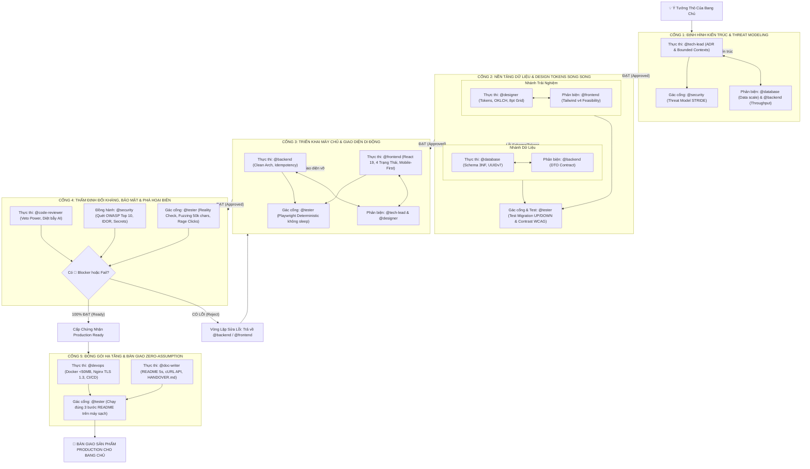

# 🚀 Kịch Bản Tác Chiến 01: Từ Ý Tưởng Đến MVP Chạy Thực Tế (Quy Trình 5 Cổng Khép Kín)

> **Mục tiêu**: Điều phối 10 chuyên gia của `mowftee-guild` theo **Mô hình Tam Giác Tác Chiến Khép Kín (Closed-Loop Multi-Agent Gate System)**. Tuyệt đối không để bất kỳ chuyên gia nào tác chiến đơn độc (siloed). Mọi giai đoạn đều có **Người Thực Thi Chính**, **Người Cố Vấn Phản Biện**, **Người Gác Cổng Kiểm Thử** và **Vòng Lặp Sửa Lỗi Tự Hành** trước khi mở cổng chuyển sang giai đoạn kế tiếp.

---

## 🗺️ Bản Đồ 5 Cổng Kiểm Soát Khép Kín (The 5 Quality Gates)



---

## 🛡️ CHI TIẾT TỪNG CỔNG TÁC CHIẾN & VÒNG LẶP PHẢN HỒI

---

### CỔNG 1: ĐỊNH HÌNH KIẾN TRÚC & THREAT MODELING (ARCHITECTURE GATE)

> **Mục tiêu**: Bóc tách ý tưởng thành ranh giới nghiệp vụ, ngăn chặn vẽ vời kiến trúc viển vông, xác lập mô hình rủi ro an ninh trước khi viết dòng code đầu tiên.

| Vai Trò | Chuyên Gia | Nhiệm Vụ Cụ Thể |
| :--- | :---: | :--- |
| **Thực thi chính** | `@tech-lead` | Phân rã Bounded Contexts, chọn Tech Stack, lập ADR kiến trúc, khởi tạo `.memory/`. |
| **Phản biện kỹ thuật** | `@database`<br>`@backend` | `@database`: Thách thức khả năng scale dữ liệu, quan hệ bảng.<br>`@backend`: Thách thức thông lượng API, độ trễ và khả năng phân tầng. |
| **Gác cổng bảo mật** | `@security` | Xây dựng ma trận hiểm họa STRIDE, ranh giới ủy thác (Trust Boundaries). |

#### 📝 Prompt Mẫu Triệu Hồi Cổng 1 Trong Antigravity:
```text
@tech-lead, @database, @backend và @security Hãy cùng bước vào CỔNG 1 để định hình dự án [Tên Dự Án] với ý tưởng: [Mô tả chi tiết ý tưởng].

1. @tech-lead (Thực thi chính): Phân tích ranh giới nghiệp vụ (Bounded Contexts), đề xuất Tech Stack tinh gọn nhất (ưu tiên Modular Monolith), lập biên bản ADR đầu tiên và khởi tạo thư mục .memory/ (architecture.md, progress.md).
2. @database và @backend (Phản biện): Đặt câu hỏi phản biện về quy mô dữ liệu dự kiến sau 1 năm và độ trễ mạng chấp nhận được.
3. @security (Gác cổng): Thực hiện Threat Modeling sơ bộ theo mô hình STRIDE. Nếu phát hiện rủi ro lộ lọt dữ liệu nhạy cảm, yêu cầu @tech-lead điều chỉnh kiến trúc ngay.
```

*Tiêu chí mở cổng*: ADR được các bên thống nhất; file `.memory/architecture.md` được ghi nhận.

---

### CỔNG 2: NỀN TẢNG DỮ LIỆU & DESIGN TOKENS SONG SONG (FOUNDATION GATE)

> **Mục tiêu**: Xây dựng cấu trúc dữ liệu chuẩn 3NF và hệ thống ngôn ngữ thị giác đồng nhất, đảm bảo tính toàn vẹn và khả năng tiếp cận WCAG ngay từ gốc rễ.

| Nhánh | Thực Thi Chính | Cố Vấn Phản Biện | Gác Cổng & Kiểm Thử |
| :--- | :---: | :---: | :---: |
| **Dữ Liệu** | `@database` | `@backend` (Rà soát DTO contracts) | `@tester` (Chạy thử migration UP/DOWN) |
| **Giao Diện** | `@designer` | `@frontend` (Soát tính khả thi Tailwind v4) | `@tester` (Đo độ tương phản WCAG 2.2 AA) |

#### 📝 Prompt Mẫu Triệu Hồi Cổng 2:
```text
@database, @designer, @backend, @frontend và @tester Hãy phối hợp tác chiến song song trong CỔNG 2:

- NHÁNH DỮ LIỆU:
  - @database: Thiết kế Lược đồ PostgreSQL chuẩn 3NF, chuẩn hóa khóa chính UUIDv7, đánh index toàn bộ khóa ngoại, và viết file Migration UP/DOWN có lệnh lock_timeout = '2s'.
  - @backend: Phản biện xem schema có thiếu trường nào cho DTO của API không.
  - @tester: Dùng Subagent chạy thử migration UP -> tạo bản ghi mẫu -> chạy migration DOWN để kiểm chứng an toàn rollback.

- NHÁNH TRẢI NGHIỆM:
  - @designer: Xây dựng bộ Design Tokens W3C, bảng màu OKLCH, thang khoảng cách 8pt Grid, Fluid Typography clamp() và đặc tả 6 trạng thái nút bấm.
  - @frontend: Phản biện về khả năng chuyển ngữ sang Tailwind CSS v4.
  - @tester: Đo kiểm độ tương phản (Contrast Ratio) của bảng màu, đảm bảo đạt chuẩn tối thiểu 4.5:1 (WCAG AA).
```

*Tiêu chí mở cổng*: Migration UP/DOWN chạy thành công exit code 0; Design Tokens không có điểm lỗi tương phản màu sắc.

---

### CỔNG 3: TRIỂN KHAI MÁY CHỦ & GIAO DIỆN DI ĐỘNG (IMPLEMENTATION GATE)

> **Mục tiêu**: Hiện thực hóa tính năng bằng mã nguồn sạch, xử lý trọn vẹn lỗi biên, bất biến chống trùng lặp và tương thích hoàn hảo trên thiết bị di động 375px.

| Vai Trò | Chuyên Gia | Nhiệm Vụ Cụ Thể |
| :--- | :---: | :--- |
| **Thực thi Backend** | `@backend` | Clean Architecture 4 tầng, DTO Zod, Idempotency-Key Redis, RFC 7807 Error Envelope. |
| **Thực thi Frontend** | `@frontend` | React 19, Mobile-First (375px), bao bọc đủ 4 trạng thái (Skeleton, Empty, Error, Success). |
| **Cố vấn & Giám sát** | `@tech-lead`<br>`@designer` | `@tech-lead`: Giám sát ranh giới module.<br>`@designer`: Giám sát độ chuẩn xác pixel-perfect và vi tương tác. |
| **Gác cổng tự động hóa** | `@tester` | Chạy bộ test Playwright Deterministic **CẤM DÙNG SLEEP**, test API status codes. |

#### 📝 Prompt Mẫu Triệu Hồi Cổng 3:
```text
@backend, @frontend, @designer, @tech-lead và @tester Bắt đầu CỔNG 3 - Triển khai hệ thống:

1. @backend: Viết API theo Clean Architecture (Controller -> Zod DTO -> Service -> Repository). Bắt buộc hỗ trợ Idempotency-Key cho thao tác tạo mới và trả về chuẩn lỗi RFC 7807 Problem Details.
2. @frontend: Dựng giao diện kết nối API theo chuẩn Mobile-First (375px). Bao bọc trọn vẹn 4 trạng thái (Loading skeleton, Empty có action, Error có nút Retry, Success). Điểm chạm nút bấm tối thiểu 44px.
3. @designer: Rà soát xem giao diện có tuân thủ đúng 6 trạng thái vi tương tác (Active scale-98, Focus-visible) không.
4. @tester: Viết kịch bản Playwright E2E kiểm tra luồng chính. Tuyệt đối không dùng sleep(), dùng web assertions toBeVisible().
```

*Tiêu chí mở cổng*: Frontend không có lỗi console đỏ; Backend trả đúng mã HTTP (không trả 200 kèm error); Playwright test chạy pass.

---

### CỔNG 4: THẨM ĐỊNH ĐỐI KHÁNG, BẢO MẬT & PHÁ HOẠI BIÊN (HARDENING GATE)

> **Mục tiêu**: Dập tắt mọi ảo tưởng về chất lượng. Dùng quyền phủ quyết (Veto) và các kịch bản phá hoại tàn khốc nhất để tìm ra lỗi trước khi người dùng nhìn thấy.

```text
┌─────────────────────────────────────────────────────────────────────────────┐
│                 TAM GIÁC GÁC CỔNG BẢO VỆ CHẤT LƯỢNG (GATE 4)                 │
├──────────────────────────────┬──────────────────────────────┬───────────────┤
│ @code-reviewer (VETO POWER)  │ @security (DEFENSE IN DEPTH) │ @tester (QA)  │
│ • Quét bẫy mã do AI sinh ra  │ • Quét rò rỉ khóa bí mật     │ • Fuzzing 50k │
│ • Bắt lỗi race condition     │ • Quét lỗ hổng IDOR & RLS    │ • Rage Clicks │
│ • Phân loại 🔴 Blocker       │ • Kiểm tra CORS, CSP, Helmet │ • Mất mạng    │
└──────────────────────────────┴──────────────────────────────┴───────────────┘
```

#### 📝 Prompt Mẫu Triệu Hồi Cổng 4:
```text
@code-reviewer, @security và @tester Hãy đồng loạt xuất hiện tại CỔNG 4 để thẩm định đối kháng toàn diện:

1. @code-reviewer: Kích hoạt Quyền Phủ Quyết (Veto Power). Soát git diff tìm các bẫy mã AI (silent catch, forEach async, boolean traps). Gắn nhãn rõ ràng: 🔴 Blocker, 🟡 Suggestion, 💭 Nit.
2. @security: Quét tìm API keys, secrets bị lộ. Thử nghiệm bẻ khóa IDOR (đổi user_id trên URL/token). Kiểm tra mã hóa đầu ra chống XSS/SQLi.
3. @tester: Thực thi bộ lệnh Reality-Check:
   - Bơm chuỗi văn bản 50.000 ký tự và ký tự lạ Unicode/Zalgo.
   - Click liên hoàn 10 lần/giây vào nút xác nhận xem có bị trừ tiền đúp không.
   - Ngắt kết nối mạng giữa chừng xem giao diện ứng xử ra sao.

⚠️ QUY TẮC KHÉP KÍN: Nếu phát hiện bất kỳ điểm chặn 🔴 Blocker hoặc bài test bị Fail, từ chối nghiệm thu ngay lập tức và trả về @backend / @frontend sửa chữa! Chỉ khi 100% ĐẠT mới cấp Chứng Nhận Production Ready!
```

*Tiêu chí mở cổng*: 0 lỗi 🔴 Blocker; 0 lỗ hổng bảo mật Critical/High; `@tester` cấp Chứng Nhận Nghiệm Thu Phát Hành (Production Readiness Certificate).

---

### CỔNG 5: ĐÓNG GÓI HẠ TẦNG & BÀN GIAO ZERO-ASSUMPTION (HANDOVER GATE)

> **Mục tiêu**: Đóng gói sản phẩm thành container siêu nhẹ, bảo mật mạng nội bộ, tự động hóa CI/CD và bàn giao tài liệu "vượt qua bài kiểm tra 5 giây" chạy ngay không lỗi.

| Vai Trò | Chuyên Gia | Nhiệm Vụ Cụ Thể |
| :--- | :---: | :--- |
| **Thực thi Hạ tầng** | `@devops` | Dockerfile đa tầng < 50MB (Alpine non-root), Docker Compose v2 mạng cô lập `internal_net`, Nginx TLS 1.3, CI/CD pinned SHA. |
| **Thực thi Tài liệu** | `@doc-writer` | README 5 giây (3 bước copy-paste chạy ngay), bảng từ điển `.env.example`, cURL API specs, cẩm nang bàn giao `docs/HANDOVER.md`. |
| **Gác cổng nghiệm thu** | `@tester`<br>`@tech-lead` | `@tester`: Clone repo sang thư mục trắng, chạy đúng 3 bước trong README để xác nhận zero-assumption.<br>`@tech-lead`: Nghiệm thu toàn diện và chốt sổ `.memory/progress.md`. |

#### 📝 Prompt Mẫu Triệu Hồi Cổng 5:
```text
@devops, @doc-writer, @tester và @tech-lead Bước vào CỔNG 5 - Đóng gói và Bàn giao:

1. @devops: Đóng gói dự án bằng Dockerfile đa tầng siêu nhẹ (<50MB, Alpine, non-root user). Cấu hình docker-compose.yml cô lập Postgres và Redis trong mạng nội bộ. Thiết lập Nginx Reverse Proxy SSL TLS 1.3 và Rate Limiting.
2. @doc-writer: Soạn thảo README.md vượt qua bài kiểm tra 5 giây với 3 bước chạy ngay. Lập bảng từ điển .env.example đầy đủ kiểu dữ liệu và viết file cẩm nang bàn giao docs/HANDOVER.md.
3. @tester (Gác cổng Zero-Assumption): Đóng vai một lập trình viên mới, mở terminal chạy thử chính xác 3 lệnh trong README.md. Nếu phát sinh bất kỳ lỗi thiếu bước nào -> Đánh trượt để @doc-writer sửa lại!
4. @tech-lead: Tổng kết toàn bộ phiên làm việc, cập nhật trạng thái 100% hoàn thành vào .memory/progress.md và bàn giao cho Bang chủ.
```

---

## 📊 Bảng Đánh Giá Vòng Lặp Phản Hồi (Revision Cycles Matrix)

| Vấn Đề Phát Sinh Tại Cổng | Chuyên Gia Báo Lỗi | Phân Loại | Người Có Trách Nhiệm Sửa | Hành Động Khép Kín |
| :--- | :---: | :---: | :---: | :--- |
| **Lộ khóa API trong code** | `@security` | 🔴 Blocker | `@backend` / `@frontend` | Thu hồi khóa, xóa git cache, chuyển sang biến môi trường `.env`. |
| **Bấm nút 5 lần tạo 5 đơn** | `@tester` | 🔴 Blocker | `@backend` & `@frontend` | Frontend khóa nút disabled; Backend thêm Idempotency-Key Redis lock. |
| **Giao diện vỡ trên màn hình 375px** | `@tester` | 🔴 Blocker | `@frontend` | Sửa layout Flex/Grid, thêm `min-w-0`, bỏ cố định `width: px`. |
| **Query quét cạn Seq Scan** | `@code-reviewer` | 🟡 Suggestion | `@database` | Bổ sung Partial Index hoặc Composite Index phù hợp. |
| **Tài liệu README chạy bị lỗi bước 2** | `@tester` | 🔴 Blocker | `@doc-writer` | Cập nhật lại câu lệnh copy-paste chuẩn chỉ, test lại trên máy sạch. |
