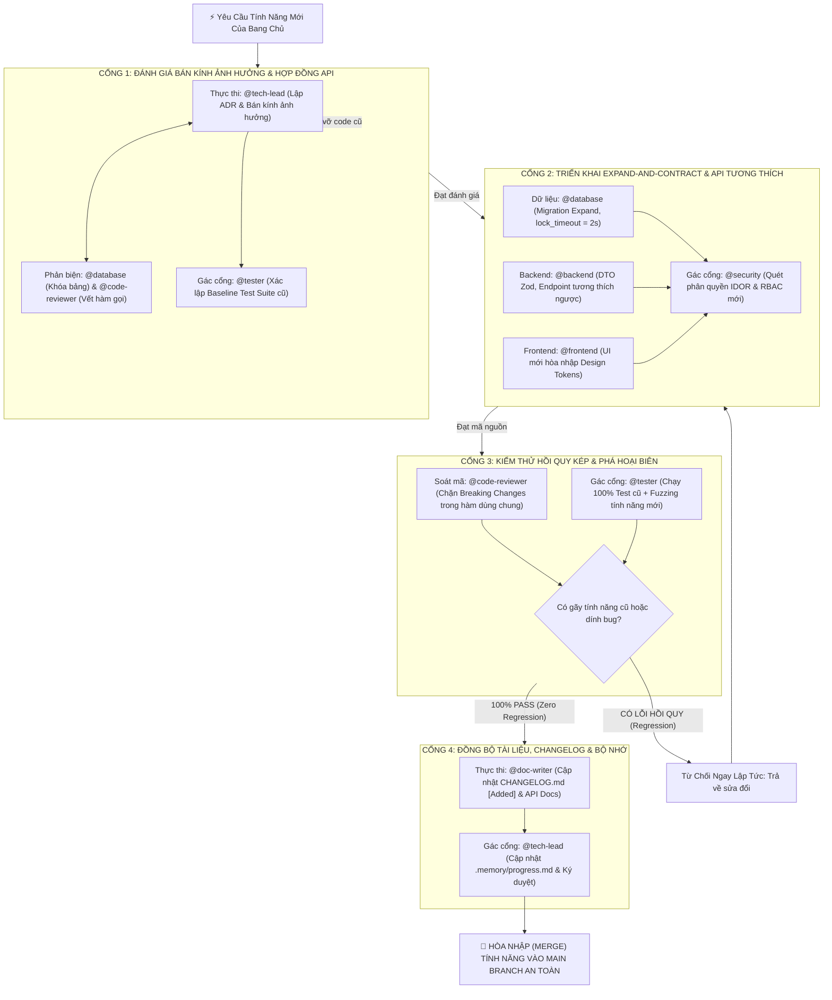

# ⚡ Kịch Bản Tác Chiến 02: Bổ Sung Tính Năng Mới (Quy Trình Khép Kín Chống Lỗi Hồi Quy - Zero Regression)

> **Mục tiêu**: Bổ sung một tính năng mới vào hệ thống đang vận hành mà **tuyệt đối không làm gãy các tính năng cũ** (Zero-Regression Policy). Toàn bộ quy trình được tổ chức thành **4 Cổng Kiểm Soát Khép Kín** với cơ chế thử nghiệm đối kháng và kiểm thử hồi quy tự động.

---

## 🗺️ Bản Đồ 4 Cổng Bổ Sung Tính Năng Khép Kín



---

## 🛡️ CHI TIẾT TỪNG CỔNG BỔ SUNG TÍNH NĂNG

---

### CỔNG 1: ĐÁNH GIÁ BÁN KÍNH ẢNH HƯỞNG & HỢP ĐỒNG API (BLAST RADIUS GATE)

> **Mục tiêu**: Xác định chính xác những module, bảng dữ liệu, và hàm nào sẽ bị tác động; ngăn chặn việc sửa đổi vô tội vạ làm vỡ các nơi gọi cũ.

| Vai Trò | Chuyên Gia | Trách Nhiệm Cụ Thể |
| :--- | :---: | :--- |
| **Thực thi chính** | `@tech-lead` | Đọc `.memory/`, phân tích Bán Kính Ảnh Hưởng (Blast Radius), viết ADR mở rộng. |
| **Phản biện dữ liệu** | `@database` | Rà soát xem bảng mới có làm chậm bảng cũ không, đánh giá nguy cơ khóa bảng khi thêm cột. |
| **Phản biện mã nguồn** | `@code-reviewer` | Quét toàn bộ codebase truy vết cây gọi hàm (Call Graph) để tìm các vị trí đang phụ thuộc. |
| **Gác cổng hồi quy** | `@tester` | Chạy bộ test hiện tại để ghi nhận **Baseline Score** (Số test đang xanh trước khi viết code mới). |

#### 📝 Prompt Mẫu Triệu Hồi Cổng 1:
```text
@tech-lead, @database, @code-reviewer và @tester Bước vào CỔNG 1 để thẩm định yêu cầu thêm tính năng: [Mô tả tính năng mới cần thêm].

1. @tech-lead: Đọc .memory/architecture.md và progress.md. Đánh giá bán kính ảnh hưởng (Blast Radius): Tính năng này có làm thay đổi bảng dữ liệu cũ hay làm gãy API cũ không? Viết bản ADR ngắn gọn đề xuất giải pháp tương thích ngược.
2. @database: Kiểm tra xem việc thêm dữ liệu mới có đòi hỏi lệnh DDL nguy hiểm nào không.
3. @code-reviewer: Dùng Subagent quét tìm tất cả các file đang gọi các hàm/service sắp bị sửa đổi.
4. @tester: Chạy bộ test hiện tại (npm test) để ghi nhận điểm mốc Baseline (phải đạt 100% pass trước khi ai đặt tay viết code mới).
```

*Tiêu chí mở cổng*: ADR được duyệt; danh sách file bị ảnh hưởng được khoanh vùng; Baseline test pass 100%.

---

### CỔNG 2: TRIỂN KHAI EXPAND-AND-CONTRACT & API TƯƠNG THÍCH (EXPAND GATE)

> **Mục tiêu**: Áp dụng mô hình di chuyển dữ liệu Expand-and-Contract, viết API tương thích ngược (Backward Compatible) và giao diện di động hòa nhập.

| Vai Trò | Chuyên Gia | Trách Nhiệm Cụ Thể |
| :--- | :---: | :--- |
| **Dữ liệu** | `@database` | Viết migration theo mô hình Expand (thêm cột Nullable, `lock_timeout = '2s'`, `CREATE INDEX CONCURRENTLY`). |
| **Backend** | `@backend` | Viết endpoint mới hoặc mở rộng DTO cũ bằng Zod (các trường mới phải là optional hoặc có default value). |
| **Frontend** | `@frontend` | Ghép giao diện mới trên mobile 375px, bao bọc đủ 4 trạng thái, không làm vỡ các component cha. |
| **Gác cổng bảo mật** | `@security` | Quét kiểm tra phân quyền IDOR và RBAC cho các endpoint/thao tác mới được tạo ra. |

#### 📝 Prompt Mẫu Triệu Hồi Cổng 2:
```text
@database, @backend, @frontend và @security Bắt đầu CỔNG 2 - Triển khai tính năng mới:

1. @database: Viết file Migration theo mô hình Expand: Chỉ thêm cột mới Nullable hoặc bảng mới, bắt buộc có lock_timeout = '2s' và đủ 2 chiều UP/DOWN.
2. @backend: Triển khai logic nghiệp vụ và API mới. Đảm bảo tính tương thích ngược: Tuyệt đối không xóa trường cũ mà client đang dùng; các trường mới phải có giá trị mặc định hợp lý.
3. @frontend: Dựng UI mới trên màn hình 375px, sử dụng đúng Design Tokens hiện có của dự án, bao bọc đủ 4 trạng thái (Loading, Empty, Error, Success).
4. @security: Rà soát phân quyền: Đảm bảo người dùng chỉ có thể thao tác trên tài nguyên thuộc quyền sở hữu của họ (chống IDOR).
```

*Tiêu chí mở cổng*: Migration UP/DOWN chạy mượt mà; API không gây lỗi 500; Security xác nhận không hở phân quyền.

---

### CỔNG 3: KIỂM THỬ HỒI QUY KÉP & PHÁ HOẠI BIÊN (ZERO-REGRESSION GATE)

> **Mục tiêu**: Người gác cổng khắt khe nhất. Đảm bảo tính năng mới chạy tốt VÀ 100% tính năng cũ không bị ảnh hưởng dù chỉ 1 pixel.

```text
┌─────────────────────────────────────────────────────────────────────────────┐
│                 BỘ ĐÔI PHÁN XỬ HỒI QUY (REGRESSION ARBITRATION)             │
├─────────────────────────────────────────────┬───────────────────────────────┤
│ @code-reviewer (SOÁT MÃ NGUỒN)              │ @tester (KIỂM THỬ ĐỐI KHÁNG)  │
│ • Soát git diff từng dòng                   │ • Chạy 100% Test Suite cũ     │
│ • Bắt lỗi Breaking Changes ở hàm dùng chung │ • Fuzzing tính năng mới       │
│ • Kích hoạt Veto Power nếu có lỗi Blocker   │ • Chạy lặp lại 10 lần liên tục│
└─────────────────────────────────────────────┴───────────────────────────────┘
```

#### 📝 Prompt Mẫu Triệu Hồi Cổng 3:
```text
@code-reviewer và @tester Hãy cùng bước vào CỔNG 3 để thực hiện Kiểm Thử Hồi Quy Kép:

1. @code-reviewer: Soát lại toàn bộ git diff. Kiểm tra xem có bất kỳ hàm dùng chung (shared utils) nào bị đổi tên hoặc đổi kiểu dữ liệu trả về mà làm gãy code ở nơi khác không.
2. @tester: Thực hiện quy trình kiểm thử 3 lớp:
   - Lớp 1 (Hồi quy): Chạy lại toàn bộ test suite cũ. Nếu có BẤT KỲ bài test cũ nào bị Fail -> LẬP TỨC ĐÁNH TRƯỢT TOÀN BỘ PR!
   - Lớp 2 (Phá hoại mới): Bơm dữ liệu quái đản (Unicode, 50k chars, rage clicks) vào tính năng mới.
   - Lớp 3 (Độ ổn định): Chạy test tính năng mới 10 lần liên tục (npx playwright test --repeat-each=10) để chứng minh 0% chập chờn (0% flaky).
```

*Tiêu chí mở cổng*: 100% test cũ pass; 100% test mới pass; không có lỗi 🔴 Blocker từ Code Reviewer.

---

### CỔNG 4: ĐỒNG BỘ TÀI LIỆU, CHANGELOG & BỘ NHỚ (CLOSURE GATE)

> **Mục tiêu**: Lưu vết lịch sử thay đổi chuẩn mực, cập nhật tài liệu kỹ thuật để đồng đội và khách hàng nắm rõ tính năng mới.

| Vai Trò | Chuyên Gia | Trách Nhiệm Cụ Thể |
| :--- | :---: | :--- |
| **Thực thi tài liệu** | `@doc-writer` | Cập nhật file `CHANGELOG.md` theo chuẩn [Keep a Changelog](https://keepachangelog.com/) mục `[Added]`, cập nhật tài liệu API và README. |
| **Gác cổng ký duyệt** | `@tech-lead` | Cập nhật tiến độ dự án vào `.memory/progress.md`, kiểm tra nợ kỹ thuật tồn đọng và ký lệnh hòa nhập (Merge). |

#### 📝 Prompt Mẫu Triệu Hồi Cổng 4:
```text
@doc-writer và @tech-lead Bước vào CỔNG 4 - Đóng gói và Ký duyệt:

1. @doc-writer: Tính năng mới đã vượt qua thẩm định! Hãy cập nhật:
   - Ghi chú phiên bản mới vào CHANGELOG.md dưới mục [Added] với mô tả ngắn gọn, dễ hiểu.
   - Bổ sung tài liệu endpoint hoặc hướng dẫn sử dụng vào README.md hoặc docs/api/.
2. @tech-lead: Đọc lại toàn bộ tiến độ, cập nhật .memory/progress.md đánh dấu hoàn thành tính năng, xác nhận không để lại nợ kỹ thuật và thông báo cho Bang chủ sẵn sàng hòa nhập mã nguồn.
```
