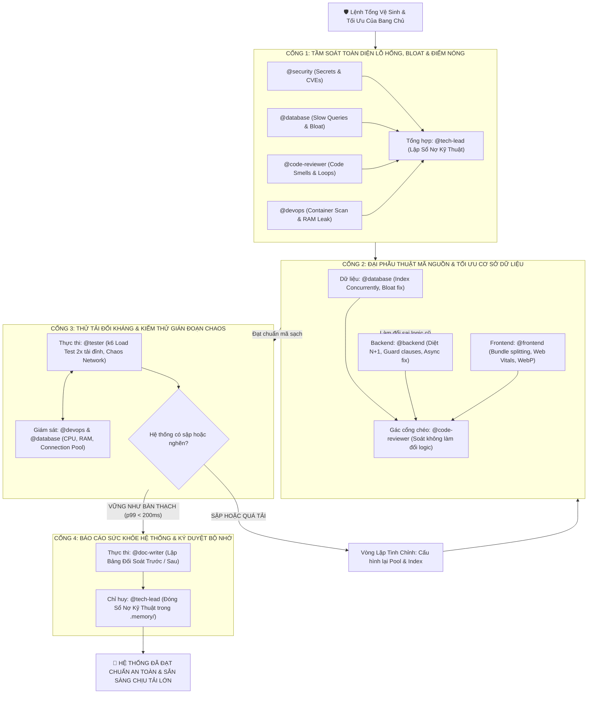

# 🛡️ Kịch Bản Tác Chiến 03: Đại Phẫu Thuật, Tối Ưu Toàn Diện & Phòng Thủ Chiều Sâu (Quy Trình 4 Cổng Khép Kín)

> **Mục tiêu**: Tiến hành "đại phẫu thuật" hệ thống định kỳ: Quét sạch mọi lỗ hổng bảo mật tiềm ẩn, xóa sổ nợ kỹ thuật (Code Smells & Dead Code), tối ưu các câu truy vấn chậm, nén dung lượng tải và thử tải cực hạn theo **Mô hình 4 Cổng Kiểm Soát Khép Kín**.

---

## 🗺️ Bản Đồ 4 Cổng Đại Phẫu Thuật Hệ Thống



---

## 🛡️ CHI TIẾT TỪNG CỔNG ĐẠI PHẪU THUẬT KHÉP KÍN

---

### CỔNG 1: TẦM SOÁT TOÀN DIỆN LỖ HỔNG & ĐIỂM NÓNG (DIAGNOSTIC GATE)

> **Mục tiêu**: 4 chuyên gia đồng loạt xuất kích như một đội đặc nhiệm trinh sát, soi tìm toàn bộ các điểm yếu của hệ thống từ tầng mã nguồn, cơ sở dữ liệu tới hạ tầng máy chủ.

| Chuyên Gia Trinh Sát | Nhiệm Vụ Tầm Soát Thực Tế |
| :--- | :--- |
| 🔐 **`@security`** | Quét tìm API keys, secrets bị commit nhầm; tra cứu CVE của toàn bộ thư viện dependencies; rà soát CORS và Security Headers. |
| 🗄️ **`@database`** | Truy vấn `pg_stat_statements` tìm 10 câu query chậm nhất (> 20ms); quét tìm các bảng thiếu index ở khóa ngoại; đo lường Index Bloat. |
| 👁️ **`@code-reviewer`** | Quét tìm các "hàm khổng lồ" (God functions > 50 dòng), cấu trúc if/else lồng quá 3 tầng, các Promise thả nổi không có catch, và các đoạn nuốt lỗi `catch (e) {}` rỗng. |
| 🚀 **`@devops`** | Quét lỗ hổng base image bằng `trivy`; kiểm tra dung lượng ổ đĩa, logs container phình to và cảnh báo rò rỉ RAM (Memory Leaks). |
| 🏛️ **`@tech-lead` (Chỉ huy)** | Tập hợp toàn bộ phát hiện của 4 trinh sát thành **Sổ Nợ Kỹ Thuật & Lỗ Hổng Bảo Mật (Debt & Security Ledger)**. |

#### 📝 Prompt Mẫu Triệu Hồi Cổng 1 Trong Antigravity:
```text
@security, @database, @code-reviewer, @devops và @tech-lead Đồng loạt xuất trận tại CỔNG 1 để tầm soát toàn diện hệ thống:

1. @security: Chạy Secret Scanner và Dependency Audit. Báo cáo các CVE có mức độ nguy hiểm High/Critical.
2. @database: Chạy lệnh tìm 10 câu query chậm nhất và các khóa ngoại chưa có index.
3. @code-reviewer: Dùng Subagent quét tìm các hàm phức tạp (>50 dòng), các vòng lặp O(n^2), và các khối nuốt lỗi.
4. @devops: Kiểm tra kích thước Docker image và quét lỗ hổng hạ tầng.
5. @tech-lead: Đứng ở trung tâm, tổng hợp toàn bộ kết quả thành bảng Sổ Nợ Kỹ Thuật có phân loại ưu tiên rõ ràng!
```

---

### CỔNG 2: ĐẠI PHẪU THUẬT MÃ NGUỒN & TỐI ƯU CƠ SỞ DỮ LIỆU (REMEDIATION GATE)

> **Mục tiêu**: Tiến hành sửa đổi, làm sạch mã nguồn và tối ưu hóa dữ liệu. **Gác cổng chéo cực kỳ khắt khe**: Tối ưu hóa code NHƯNG TUYỆT ĐỐI KHÔNG ĐƯỢC LÀM THAY ĐỔI LOGIC NGHIỆP VỤ CŨ.

| Mảng Xử Lý | Chuyên Gia Thực Thi | Gác Cổng Thẩm Định Chéo |
| :--- | :---: | :---: |
| **Cơ Sở Dữ Liệu** | `@database` | `@code-reviewer` (Soát file migration an toàn) |
| **Hệ Thống API** | `@backend` | `@code-reviewer` (Soát tính toàn vẹn nghiệp vụ) |
| **Giao Diện Web** | `@frontend` | `@designer` (Soát tính đồng nhất thị giác) |
| **Vá Lỗi Bảo Mật** | `@security` | `@tech-lead` (Kiểm tra tương thích phiên bản) |

#### 📝 Prompt Mẫu Triệu Hồi Cổng 2:
```text
@database, @backend, @frontend, @security và @code-reviewer Tiến hành CỔNG 2 - Đại phẫu thuật:

1. @database: Viết migration bổ sung Partial Indexes cho các query chậm; chạy REINDEX CONCURRENTLY cho các chỉ mục bị phình to (bloat); cấu hình lại connection pool theo công thức (Cores * 2) + 1.
2. @backend: Diệt sạch các vòng lặp N+1 bằng json_agg; làm phẳng các tầng if/else bằng Guard Clauses; xóa bỏ các Promise thả nổi và thêm timeout cho mọi cuộc gọi mạng bên ngoài.
3. @frontend: Phân tách gói mã nguồn (Code Splitting), áp dụng tải lười (Lazy Loading); nén toàn bộ ảnh sang WebP/AVIF; triệt tiêu hoàn toàn giật khung hình (CLS = 0).
4. @security: Thu hồi và cấp lại các khóa bí mật; nâng cấp các thư viện dính CVE; cấu hình lại Helmet CSP và CORS nghiêm ngặt.
5. @code-reviewer (Gác cổng chéo): Soát từng dòng git diff để bảo đảm việc refactor KHÔNG làm thay đổi bất kỳ logic nghiệp vụ nào!
```

---

### CỔNG 3: THỬ TẢI ĐỐI KHÁNG & KIỂM THỬ GIÁN ĐOẠN CHAOS (STRESS & CHAOS GATE)

> **Mục tiêu**: Bơm tải gấp đôi ngày bình thường để kiểm chứng xem hệ thống sau khi tối ưu có thực sự "vững như bàn thạch" hay chỉ là tối ưu trên giấy tờ.

```text
┌─────────────────────────────────────────────────────────────────────────────┐
│                 TAM GIÁC THỬ TẢI ĐỐI KHÁNG (STRESS & CHAOS TRIANGLE)        │
├─────────────────────────────┬───────────────────────────────┬───────────────┤
│ @tester (TẤN CÔNG BƠM TẢI)  │ @devops (GIÁM SÁT HẠ TẦNG)    │ @database     │
│ • Bắn k6 load test 2x đỉnh  │ • Soi CPU / RAM utilization   │ • Soi Pool    │
│ • Thử thách ngắt kết nối    │ • Phát hiện rò rỉ bộ nhớ      │ • Soi Deadlock│
│ • Bắn 500 req/s đồng thời   │ • Đo thời gian tự phục hồi    │ • Đo trễ I/O  │
└─────────────────────────────┴───────────────────────────────┴───────────────┘
```

#### 📝 Prompt Mẫu Triệu Hồi Cổng 3:
```text
@tester, @devops và @database Bước vào CỔNG 3 - Kiểm Thử Chịu Tải Cực Hạn:

1. @tester: Dùng công cụ k6 hoặc autocannon bắn 500 kết nối đồng thời vào các API cốt lõi trong 30 giây. Thử nghiệm kịch bản Chaos: Đột ngột ngắt kết nối cơ sở dữ liệu trong 2 giây rồi mở lại xem hệ thống có tự phục hồi không.
2. @devops: Giám sát sát sao mức sử dụng CPU và RAM của container ứng dụng. Nếu RAM liên tục tăng không giảm -> Báo động rò rỉ bộ nhớ (Memory Leak)!
3. @database: Giám sát Connection Pool: Đảm bảo không có kết nối nào bị kẹt ở trạng thái "idle in transaction" và 0 lỗi Deadlock xảy ra.

⚠️ TIÊU CHÍ VƯỢT CỔNG: 
- Tỷ lệ lỗi (Error Rate) < 0.01%.
- Độ trễ phân vị p99 < 200ms dưới tải cao.
- Ứng dụng tự phục hồi trong 5 giây sau khi mạng bình thường trở lại.
```

---

### CỔNG 4: BÁO CÁO SỨC KHỎE HỆ THỐNG & KÝ DUYỆT BỘ NHỚ (CERTIFICATION GATE)

> **Mục tiêu**: Đo lường định lượng thành quả bằng những con số thép (Trước vs Sau) và cập nhật Bộ nhớ Dự án.

| Vai Trò | Chuyên Gia | Trách Nhiệm Cụ Thể |
| :--- | :---: | :--- |
| **Thực thi báo cáo** | `@doc-writer` | Soạn thảo **Báo Cáo Sức Khỏe Hệ Thống (System Health Dossier)** đối soát chỉ số Trước vs Sau. |
| **Ký duyệt hoàn tất** | `@tech-lead` | Xóa các mục đã xử lý trong Sổ Nợ Kỹ Thuật, cập nhật `.memory/progress.md` và bàn giao kết quả cho Bang chủ. |

#### 📝 Mẫu Báo Cáo Sức Khỏe Hệ Thống (System Health Dossier):
```markdown
# 📊 BÁO CÁO SỨC KHỎE HỆ THỐNG SAU ĐỢT TỔNG VỆ SINH

- **Ngày thực hiện**: [YYYY-MM-DD]
- **Chỉ huy trưởng**: `@tech-lead`

## 📈 Bảng Đối Soát Chỉ Số Trước vs Sau:
| Chỉ Số Đo Lường | Trước Khi Vệ Sinh | Sau Khi Tối Ưu | Mức Độ Cải Thiện |
| :--- | :---: | :---: | :---: |
| **Lỗ hổng bảo mật (CVEs)** | 5 (2 Critical, 3 High) | **0 lỗ hổng** | 🟢 Đã vá sạch 100% |
| **Độ trễ truy vấn trung bình (p95)** | 145ms | **14ms** | 🟢 Nhanh gấp 10 lần |
| **Số truy vấn chậm (> 50ms)** | 12 queries | **0 queries** | 🟢 Đã đánh chỉ mục |
| **Kích thước Bundle Frontend** | 680 KB | **180 KB** | 🟢 Giảm 73% dung lượng |
| **Kích thước Docker Image** | 1.15 GB | **46 MB** | 🟢 Giảm 96% dung lượng |
| **Điểm chỉ số Web Vitals (INP)** | 280ms (Kém) | **85ms (Rất tốt)** | 🟢 Mượt mà tức thì |

👉 **KẾT LUẬN**: Hệ thống đã được khử sạch mã độc, triệt tiêu nợ kỹ thuật và sẵn sàng phục vụ quy mô tải gấp 10 lần mà không cần nâng cấp phần cứng máy chủ! 🚀
```
